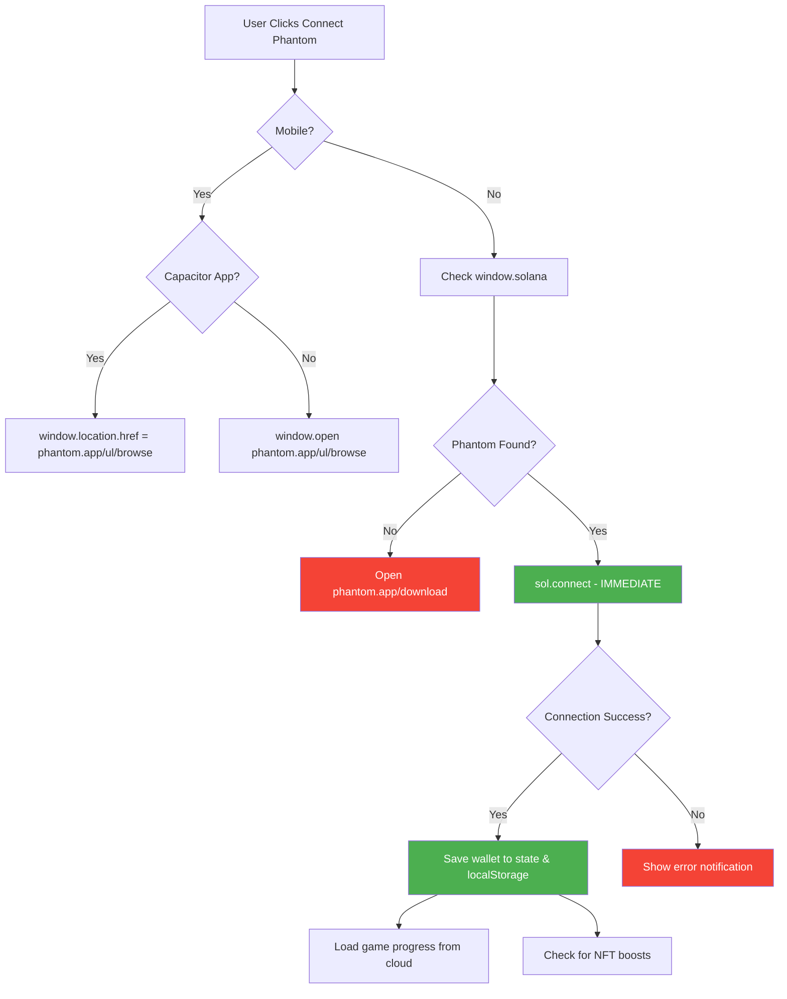
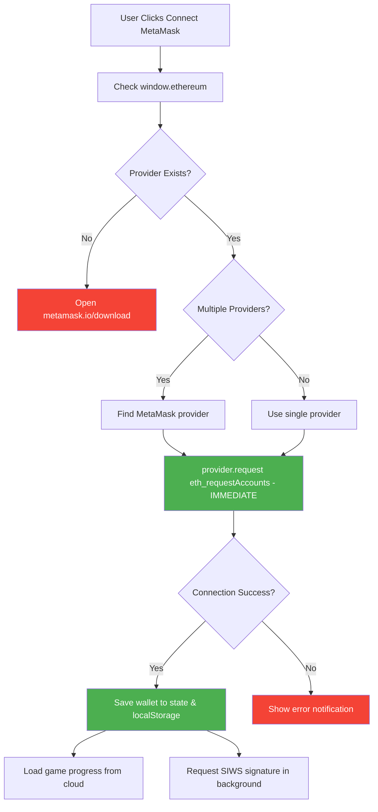
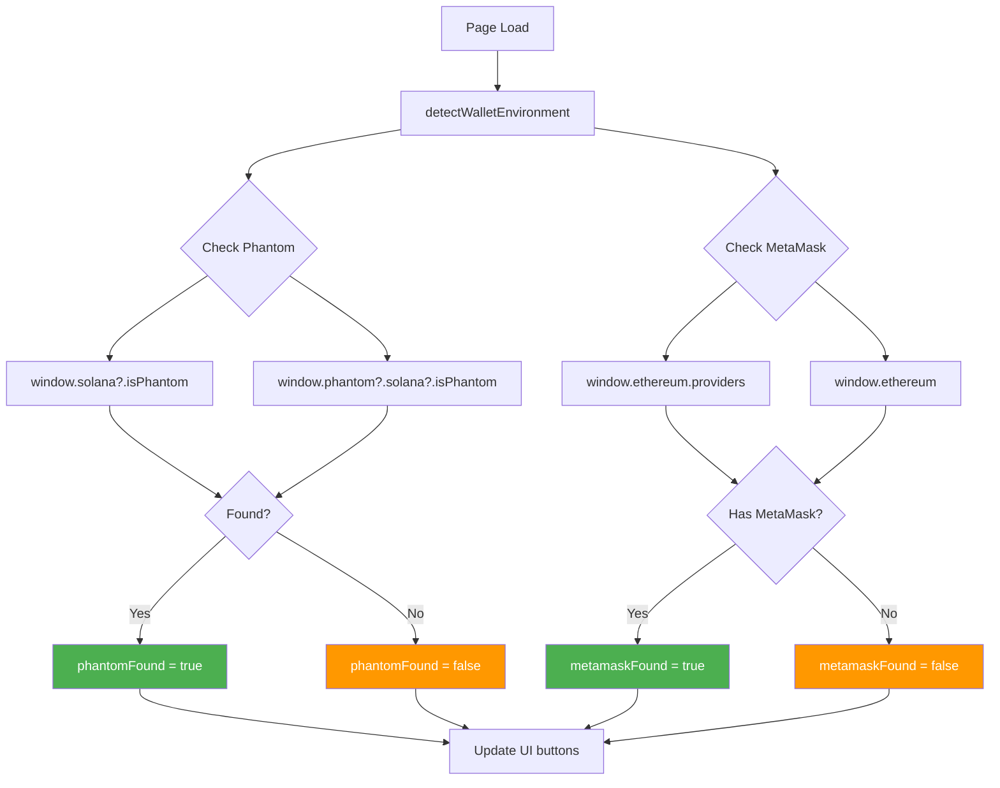

# 🏦 Wallet Connection Flow Diagram

## Phantom Connection Flow



## MetaMask Connection Flow



## Wallet Detection Flow



## Key Timing Notes

### ✅ CORRECT Flow (After Fix):
```
User Click → Immediate Extension Call (< 0.5s) → Popup Appears
```

### ❌ WRONG Flow (Before Fix):
```
User Click → Async Operations → Delay → Extension Call → Timeout → Popup (too late)
```

## Critical Implementation Details

### 1. User Gesture Preservation
```typescript
// ✅ CORRECT - Synchronous call preserves gesture
onClick={() => {
  connectPhantom(); // Called directly
}}

// Inside connectPhantom():
const res = await sol.connect({ onlyIfTrusted: false });
// ^ This await is OK because it's THE FIRST async operation
```

### 2. No Blocking Operations Before Connection
```typescript
// ❌ WRONG - Don't do this before connection
await someAPI.call();  // Blocks user gesture
await loadProgress();  // Blocks user gesture
const res = await sol.connect();  // Too late!

// ✅ CORRECT - Connection first, everything else after
const res = await sol.connect();  // First!
await someAPI.call();  // Now it's OK (background)
```

### 3. Immediate Error Handling
```typescript
try {
  const res = await sol.connect();
  if (!res.publicKey) throw new Error("No key");
} catch (e) {
  // Show error immediately
  stateRef.current.notification = { text: "FAILED", life: 120 };
}
```

## Mobile Deep Link Structure

### Phantom Universal Link:
```
https://phantom.app/ul/browse/{ENCODED_URL}?ref={ENCODED_URL}
```
- Opens Phantom app if installed
- Falls back to App Store if not
- Preserves return URL for deep linking

### MetaMask Deep Link:
```
https://metamask.app.link/dapp/{DOMAIN}
```
- Opens MetaMask app if installed  
- Falls back to app store if not
- Auto-returns to dapp after approval

## Desktop Extension Injection

### Phantom:
```javascript
window.solana           // Primary
window.phantom.solana   // Fallback
```

### MetaMask:
```javascript
window.ethereum                    // Single provider
window.ethereum.providers[]        // Multiple providers (Brave, etc.)
```

## Error Recovery Strategies

| Error Type | Recovery Action |
|------------|----------------|
| Extension not found | Open download page in new tab |
| User rejects | Show error, allow retry |
| Timeout | Show error, suggest refresh |
| Network error | Retry once, then show error |
| Signature fails | Continue anyway (non-blocking) |

---

**Last Updated:** March 29, 2026  
**Purpose:** Visual documentation for wallet connection implementation
